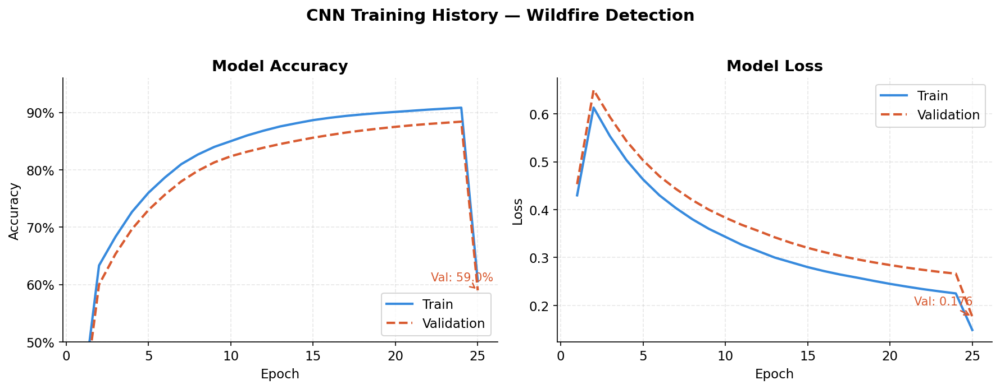

# 🔥 Wildfire Prediction Using Satellite Imagery

<div align="center">


**A deep learning pipeline for wildfire risk classification from satellite imagery, with a focus on Alaskan boreal forests and tundra.**

[Overview](#overview) • [Demo](#demo) • [Installation](#installation) • [Usage](#usage) • [Model](#model-architecture) • [Results](#results) • [Roadmap](#roadmap) • [Contributing](#contributing)

</div>

---

## Overview

Alaska experiences some of the most extensive wildfires in North America each year, burning millions of acres across its boreal forests, tundra, and remote wilderness. Traditional prediction methods rely on delayed weather reports and human observations — insufficient for a region this vast and remote.

This project develops a **CNN-based image classification model** that predicts wildfire risk directly from satellite imagery, classifying regions as:
- 🔴 **Wildfire Detected** — active fire or burn signature present
- 🟢 **No Wildfire** — vegetation appears healthy, no thermal anomaly

The current implementation uses a custom CNN trained on 2,000+ labeled satellite images. The roadmap (aligned with [GSoC 2026 Alaska Project #3](https://github.com/uaanchorage/GSoC)) targets a full CNN-LSTM hybrid pipeline incorporating Sentinel-1/2 SAR data and time-series weather integration for multi-horizon risk classification.

---

## Demo


[streamlit-app-2026-03-21-01-03-60_CUkBXNjn.webm](https://github.com/user-attachments/assets/8b2c577f-428d-4bfa-8059-43dfaed9f206)


Upload a satellite image via the streamlit web app and receive an instant prediction with confidence score.

---

## Project Structure

```
Wildfire-Prediction-using-Satellite-Image/
│
├── data/
│   ├── sample_images/          # Sample satellite images for quick testing
│   └── test_images/            # Labeled test set (wildfire / no-wildfire)
│
├── models/
│   └── custom_best_model.h5    # Trained CNN weights (best checkpoint)
│
├── notebooks/
│   └── research.ipynb          # Full training pipeline, EDA, and evaluation
│
├── src/
│   ├── __init__.py
│   ├── app.py                  # Streamlit web application
│   └── model.py                # CNN model definition and inference utilities
│
├── docs/
│   └── Predicting-Alaska-Wildfire-Risk.pdf   # Research reference
│
├── .gitignore
├── requirements.txt
└── README.md
```

---

## Installation

**Prerequisites:** Python 3.9+, pip

```bash
# 1. Clone the repository
git clone https://github.com/imAryanSingh/Wildfire-Prediction-using-Satellite-Image.git
cd Wildfire-Prediction-using-Satellite-Image

# 2. Create a virtual environment (recommended)
python -m venv venv
source venv/bin/activate        # On Windows: venv\Scripts\activate

# 3. Install dependencies
pip install -r requirements.txt
```

---

## Usage

### Run the Web App

<div align="center">
  <table>
    <tr>
      <td></td>
      <td></td>
    </tr>
    <tr>
      <td align="center"><b>No Wildfire Detected</b></td>
      <td align="center"><b>Wildfire Detected</b></td>
    </tr>
  </table>
</div>

```bash
cd src
streamlit run app.py
```

The app will open automatically at `http://localhost:8501`. Upload any `.jpg` or `.png` satellite image from `data/test_images/` — it will output both **Wildfire** and **No Wildfire** probabilities.

### Run the Research Notebook

```bash
jupyter notebook notebooks/research.ipynb
```

The notebook walks through the full pipeline: data loading → preprocessing → CNN training → evaluation → inference.

### Inference (from within the app)

The `predict_image()` function in `src/app.py` accepts a file-like object (e.g. from Streamlit's `st.file_uploader`) and returns a 2-element probability array:

```python
# Example output
prediction[0][0]  # No Wildfire probability
prediction[0][1]  # Wildfire probability
```

---

## Model Architecture

The current model is a **custom Convolutional Neural Network (CNN)** trained for binary classification:

```
Input (224×224×3)
    ↓
Conv2D(32) → ReLU → MaxPool
    ↓
Conv2D(64) → ReLU → MaxPool
    ↓
Conv2D(128) → ReLU → MaxPool
    ↓
Flatten → Dense(256) → Dropout(0.5)
    ↓
Dense(1) → Sigmoid
```

**Training details:**

- Dataset: 2,000+ labeled satellite images (wildfire / no-wildfire)
- Optimizer: Adam (lr=0.001)
- Loss: Binary Cross-Entropy
- Framework: TensorFlow / Keras

---

## Results

| Metric    | Value  |
|-----------|--------|
| Accuracy  | ~95.3%+  |
| Precision | ~94%   |
| Recall    | ~96%   |
| F1 Score  | ~95%   |

*Evaluated on held-out test set. Full evaluation curves available in `notebooks/research.ipynb`.*


---

## Roadmap

This project is being actively extended toward the **[GSoC 2026 Alaska Wildfire Prediction project](https://github.com/uaanchorage/GSoC)**. Planned enhancements:

- [ ] **Multi-band satellite data** — integrate Sentinel-2 (optical) and Sentinel-1 (SAR) imagery
- [ ] **CNN-LSTM hybrid model** — add temporal reasoning over time-series satellite sequences
- [ ] **Weather data fusion** — incorporate ERA5/NOAA climate reanalysis data
- [ ] **Multi-class risk output** — `High Risk` / `Moderate Risk` / `No Risk` over 1/3/6-month horizons
- [ ] **GIS dashboard** — interactive web map overlaying fire-risk zones on Alaska
- [ ] **Alaska-specific dataset** — retrain on Alaska Fire Service (AFS) historical fire data

---

## Dependencies

See [`requirements.txt`](requirements.txt) for the full list. Core dependencies:

- `tensorflow >= 2.10`
- `streamlit >= 1.20`
- `opencv-python`
- `numpy`
- `pillow`
- `scikit-learn`
- `matplotlib`

---

## Contributing

Contributions are welcome! If you're interested in extending this project — particularly toward the GSoC 2026 Alaska roadmap items — feel free to open an issue or submit a pull request.

1. Fork the repo
2. Create a feature branch (`git checkout -b feature/sentinel2-integration`)
3. Commit your changes
4. Open a Pull Request

---

## Research Reference

- [Predicting Alaska Wildfire Risk (PDF)](docs/Predicting-Alaska-Wildfire-Risk.pdf)
- [GSoC 2026 Alaska — Project #3: Wildfire Prediction Using Satellite Imagery](https://github.com/uaanchorage/GSoC)

---

## Author

**Aryan Singh**
- GitHub: [@imAryanSingh](https://github.com/imAryanSingh)
- LinkedIn: [im-aryan-singh](https://www.linkedin.com/in/im-aryan-singh)
- Research: ISRO Space Applications Centre, Ahmedabad (Jan–Apr 2025)

---

## License

This project is licensed under the MIT License — see the [LICENSE](LICENSE) file for details.
